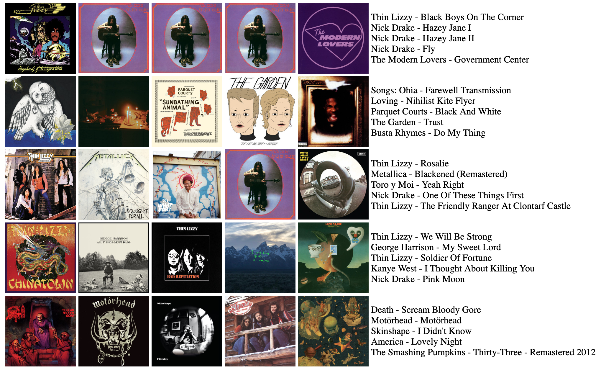

# Spotitude

Yet another Spotify user analytics visualizer!

Spotify unfortunately doesn't provide users their top tracks. Spotitude is a simple visualization tool for your top 25 tracks. It produces a 5x5 grid of your top tracks along with their names.
You can take a screenshot of this visualization and share it with other music fans on your favorite forums or image boards!



### Requirements
* Python 3
* pip3
* Access to Spotify's API

### Getting Started

First, install the dependencies by running:

```
$ make deps
```

By using Python3's [venv](https://docs.python.org/3/library/venv.html), we make sure that the dependencies only reside in the scope of this project.

After the installation is complete, we need to configure the credentials. Spotitude requires the user to have access to [Spotify's API](https://developer.spotify.com/). When creating your new app through the API, set your redirect uri to `http:localhost:8080`.
Once you have finished creating your app and have your credentials, we need to create a config file to save your credentials. To create a config file, run:

```
$ make config
```

Open up the newly created `spotitude.config` and input your credentials.

### Create Visualizations!

Start the web server by running:

```
$ make server
```

This will create the page the visualizations will be displayed on. By default Spotitude uses `http://localhost:8080`.

Next, you should also make sure to activate the virtual environment first by running:

```
$ source venv/bin/activate
```

While using the virtual environment you can create a visualization by running:

```
$ python3 spotitude.py
```

You can also choose over what time frame the top tracks are computed by specifying the optional argument `--time_range`. Valid values for `time_range` are `short_term`, `medium_term` and `long_term`. For example:

```
$ python3 spotitude.py --time_range medium_term
```

If you want to stop using the using the virtual environment, simply use:
```
$ deactivate
``` 

### Contributing to the Project

Spotitude is open to any improvements or fixes. Before submitting a pull request, make sure your code is formatted by running:

```
$ make clean
```

This is also removing the `venv` with your dependencies.