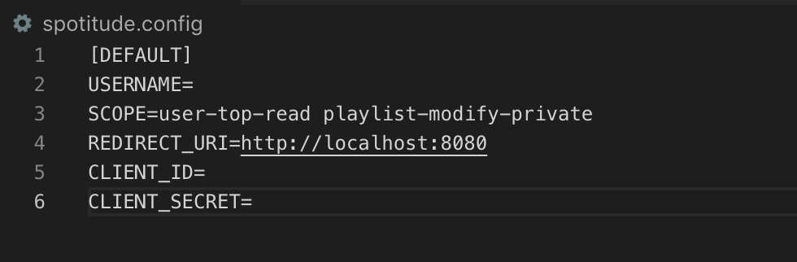
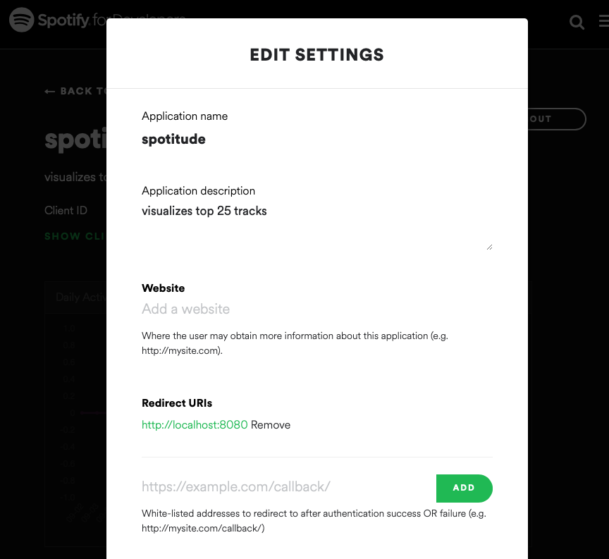
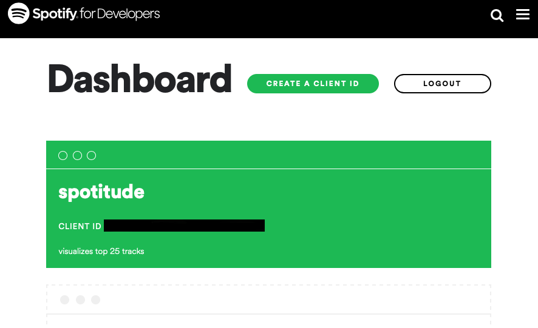
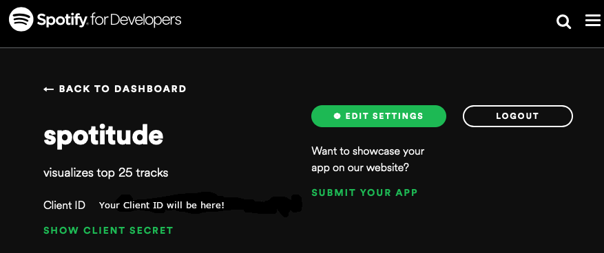

# Spotitude Credentials Setup

Once you have finished creating your app and have your credentials, we need to create a config file to save your credentials. To create a config file, run:

```
$ make config
```

Once you've run make config, there should be a file in the main directory that looks like this when you open it:



### Entering Your Credentials
Now, you will need to enter your credentials. Note that the values entered <b>should not contain quotes</b> (e.g. REDIRECT_URI=https://google.com).

* For USERNAME, input your Spotify username, so that it reads USERNAME=yourUsername. <b>Your username is not what you use to log into your account</b> and is normally found in <b>Profile > Account > Account overview</b> by logging into [Spotify's website](https://www.spotify.com/).
* You should not need to modify the SCOPE variable. 

You don't need to modify REDIRECT_URI either, but note that the redirect URI needs to be configured in your Spotify app in your developer's account, as disccused in the [README](README.md). If you haven't already, go to [Spotify's Developer Dashboard](https://developer.spotify.com/dashboard/applications) and click "Create a Client ID". When creating your new app through the API, set your redirect uri to `http:localhost:8080`.
If you have done this correctly, your settings page should now look like this:



Make sure that the redirect URI is exactly the same between your app and what's in spotitude.config, e.g. one cannot be https://google.com/ and the other https://google.com.

You will find the values that you need for CLIENT_ID and CLIENT_SECRET through the Spotify for Developers' [Dashboard](https://developer.spotify.com/dashboard/applications). Once you log in, the dashboard screen should look like this:



Click on the app that you created earlier. When you click on the app that you created, it should look like this:



In the CLIENT_ID and CLIENT_SECRET fields in your `spotitude.config`, input the Client Id and Client Secret Key as they appear in your broswer.

Your `spotitude.config` file should now be ready to go!

### Common Issues and Fixes
* If you log in to Spotify with a Facebook account, you can still find your account in <b>Account > Account overview</b>.
* If you find that you have issues with scope or with your URI after carefully following the directions above, try using https://google.com for your redirect URI. See also [this issue](https://github.com/dtcrout/spotitude/issues/11).
* Double check your redirect URI in your config file and app and make sure they are exactly the same.
* It also helps to make sure you are running the app with the proper version of Python with the dependencies installed. For more on how to do this, see the [README](README.md).