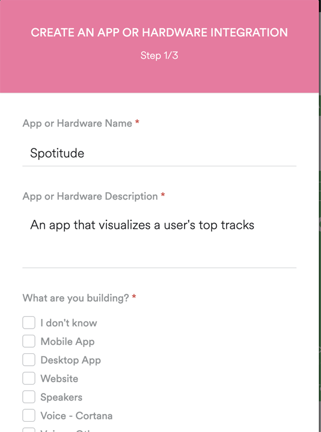
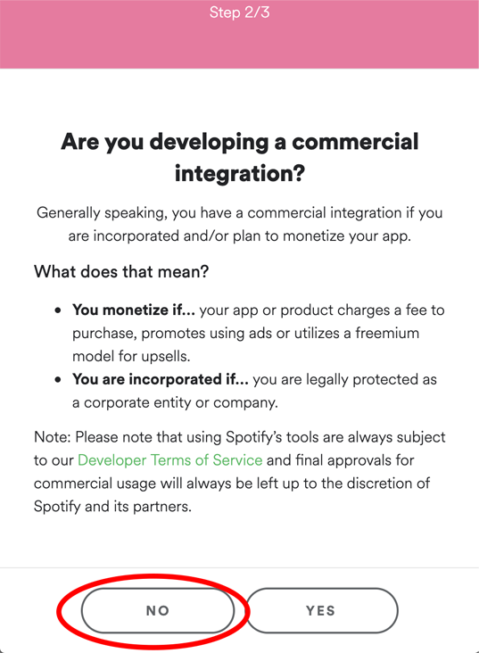
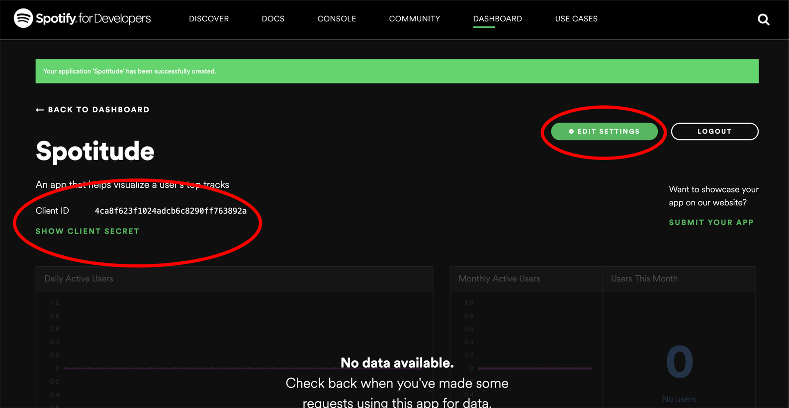
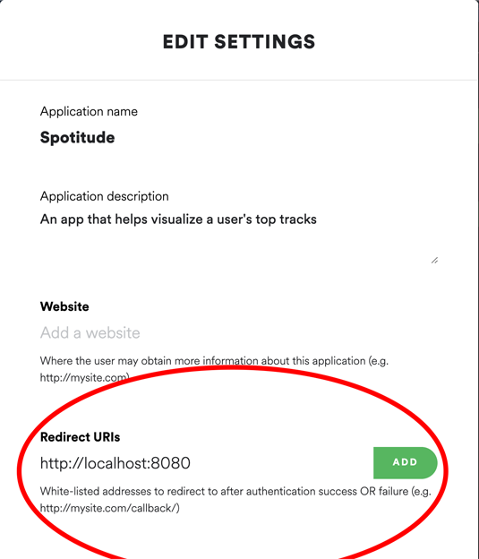

#Setting up the config file 
In order to use Spotitude, you will need to create a config file

Before starting, run

```
$ make config
```

Open up the file spotitude.config. This will be where you input your credentials

###Setting up a Spotify Developer Account
In order to use Spotitude, you must set up a Spotify Developer account. 
Go to https://developer.spotify.com/dashboard/login to sign up for an account or login. 

After logging in, click on the button that says "Create a client ID"


Fill out the form and select No when asked if this app is for commercial use





Click submit and you will be redirected to your dashboard




Enter your username into 'spotitude.config' 

Click "Show Client Secret" on the left side of the page and paste both your client ID and client secret into 'spotitude.config' 


Click on edit settings on the upper right side of the page




Paste http://localhost:8080 into the field titled Redirect URI and click add


With that, you are finished with the config file
